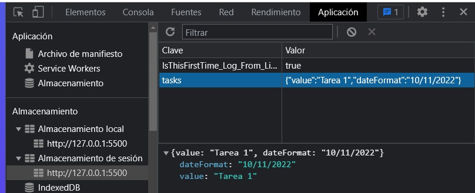
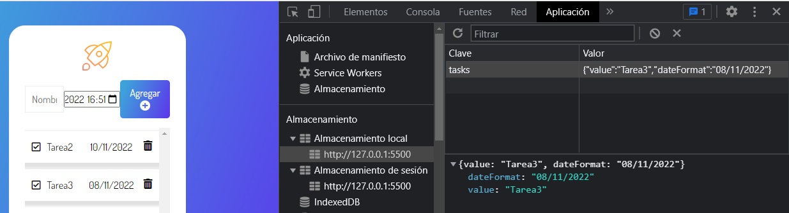
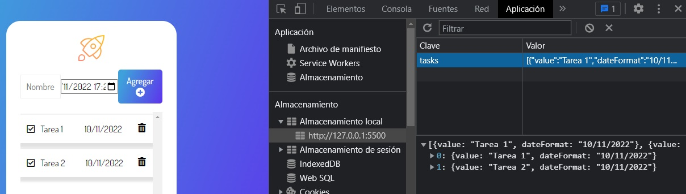

# JS-6-Alura

https://github.com/alura-es-cursos/1822-Almacenando-Datos-En-El-Navegador

Tomamos la fecha que ingresa el usuario y lo almacenamos en el objeto calendar
```javascript
const calendar = document.querySelector('[data-form-date]');
```
Obtengo el valor del objeto calendar
```javascript
const date = calendar.value;
```
Usamos una libreria para estandarizar el ingreso de fechas para distintos navegadores.
https://momentjs.com/
Es una libreria que se encarga de trabajar con fechas en el navegador.
Para obtener el código utilizamos una página que se llama
https://cdnjs.com/
https://cdnjs.com/libraries/moment.js
Copiamos el código y lo añadimos en el index.html
```html
<script src="https://cdnjs.cloudflare.com/ajax/libs/moment.js/2.29.4/moment.min.js"></script>
```
De esta manera ya tenemos acceso a la funcion moment
```js
console.log(moment(date).format('DD/MM/YYYY'));
const dateFormat = moment(date).format('DD/MM/YYYY');
```

Los navegadores permiten que nosotros nos comuniquemos con ellos a través de una interface que posee una lista de métodos de objetos a los que podemos acceder con JavaScript.

Dentro de esta lista vamos a acceder a un objeto llamado Date(), pero primero necesitamos instanciar ese objeto.

```
const data = new Date()
\\ Wed Oct 14 2020 14:14:24 GMT-0600 (Ciudad de México Standard Time)
```
Podemos ver que accedimos a varias informaciones de la fecha. El objeto Date() posee varios métodos para trabajar con fechas. Por ejemplo, si quisiéramos editar esa primera información para un formato que exhibirá la fecha separada por diagonales podemos utilizar el método toLocaleDateString:

```
data.toLocaleDateString('es-MX')
\\ "10/14/2020"COPIA EL CÓDIGO
```
Ese formato puede ser configurable: por ejemplo, podemos crear un objeto que va a contener la llave de la fecha y al valor para definir cómo queremos exhibir la fecha:

````
const dataOptions = {
   weekend: 'long',
   year: 'numeric',
   month:'long',
   day: 'numeric'
}
````
Ahora necesitamos llamar dataOptionscomo segundo parámetro:

````
data.toLocaleDateString('es-MX', dataOptions)
\\ 28 de agosto de 2020
````

¿Y el horario? El navegador posee un método llamado toLocaleTimeString() que muestra el horario del navegador y, así como en el método de fecha, pasemos es-mx como parámetro. Así, la fecha será formateada para el patrón utilizado en México.

````
data.toLocaleTimeString()
\\ “9:04:54 AM”
````

El resultado es configurable así como el de la fecha, con el mismo proceso de crear objeto con llave y valor, que después pasamos como parámetro.

````
const horarioOptions = {
   hour12: false,
   hour: 'numeric',
   minute: '2-digit',
   second: '2-digit', 
   timeZone: 'America/Sao_Paulo'
}
````
Usando horarioOptionscomo argumento de la función ToLocaleTImeString, tenemos:
```
data.toLocaleTimeString('es-MX', horarioOptions)
\\ “9:04:54”
```

Podemos combinar todas esas opciones utilizando el método toLocaleString(). Usando esos tres puntos antes del objeto, estamos indicando que todas las llaves/valor del objeto pasarán para ese nuevo objeto. Esa sintaxis se llama spread operator.

```
data.toLocaleString('es-MX', {
   ...dataOptions, 
   ...horarioOptions
})
\\ “28 de agosto de 2020 9:04:54”
```
Si necesitamos usar ese formato en varios lugares del código, podemos utilizar el objeto Intl.DateTimeFormat que es un contructor, o sea, recibirá informaciones iniciales de cómo queremos que la fecha esté formateada.
```
const formataData = new Intl.DateTimeFormat('es-MX', {
   ...dataOptions,
   ...horarioOptions
})
```

Para terminar, llamando el método format, podemos formatear diferentes fechas caso sea necesario.

```
formataData.format(data)
\\ “28 de agosto de 2020 9:04:54”
```
Está claro que trabajar con fechas utilizando API del navegador nos trae ventajas y desventajas, y depende de tu proyecto aprovechar esa flexibilidad de customizaciones.

# Creamos un elemento span
```js
const dateElement = document.createElement('span');
```
Luego le agregamos el contenido
```js
dateElement.innerHTML = dateFormat;
```
Lo añadimos al task
```js
task.appendChild(dateElement);
```
# Almacenamiento
https://developer.mozilla.org/es/docs/Web/API/Storage

La interfaz Storage de la API de almacenamiento web provee acceso al almacenamiento de la sesión o al almacenamiento local para un dominio en particular, permitiéndote por ejemplo añadir, modificar o eliminar elementos de dato almacenados.

Si deseas manipular el almacenamiento de sesión para un dominio, debes llamar al método ``Window.sessionStorage``; Si deseas manipular el almacenamiento local para un dominio, debes llamar a ``Window.localStorage``.

Creamos un objeto para almacenar la información que creemos es necesaria.
```js
// Información que vamos a necesitar
  // La tarea y la fecha
  console.log(value, dateFormat);
  const taskObj = {
    value,
    dateFormat,
  };
  // Mandamos a llamar
  sessionStorage.setItem("tasks", taskObj);
```
Con el objeto JSON vamos a poder almacenar información.  
Tiene diferentes métodos

Métodos estáticos
``JSON.parse()``
Analice un fragmento de texto de cadena como JSON, transformando opcionalmente el valor producido y sus propiedades, y devuelva el valor.

``JSON.stringify()``
Retorna una cadena JSON correspondiente al valor especificado, incluyendo opcionalmente solo ciertas propiedades o reemplazando valores de propiedad de una manera definida por el usuario.

```js
sessionStorage.setItem("tasks", JSON.stringify(taskObj));
```


La informacion que nos esta proporcionando el usuario la estamos guardando el sessionsStorage.
Recargo la página y mantengo los datos. El tasks se mantiene. Pero si cierro la pestaña se pierde la información. En sessionsStorage la información vive o persiste mientras la pestaña este abierta.

# Introducción a las APIs web
https://developer.mozilla.org/es/docs/Learn/JavaScript/Client-side_web_APIs/Introduction

# localStorage
```js
localStorage.setItem("tasks", JSON.stringify(taskObj));
```


Queda almacenada la última tarea.  
Si cierro la pestaña y la vuelvo abrir queda la información de la última tarea.
```js
const taskList = [];
taskList.push(taskObj);
localStorage.setItem("tasks", JSON.stringify(taskList))
```
El cambio de const a let o var en un arreglo aplica para el tipo no para su contenido.
El contenido puede cambiar pero no su tipo.

Ahora podemos almacenar diferentes tareas.
Pero cuando recargo y agrego otra tarea sobrescribe lo anterior y se pierden las tareas anteriores, queda solo la actual. Cada vez que se reinice la pagina el arreglo se inicializa como vacio y se pierde la información.
Entonces lo que tenemos que hacer es que cada vez que se reinicie la aplicacion tomar el contenido de localStorage y cargarlo al array.  
 La manera correcta de transformar los datos en string es a través de JSON.stringify y aprovechamos para utilizar el setItem para almacenar los datos localmente.

# Reacomodamos el código
Creamos el componente addTask.js
```js
// Para obtener la informacion del localStorage
  const taskList = JSON.parse(localStorage.getItem('tasks')) || [];
  console.log(taskList);
```
# Cortocircuito pipe
Durante el curso utilizamos pipe || para crear una nueva evaluación de cortocircuito( short circuit evaluation).
```js
const tasks = JSON.parse(localStorage.getItem('tasks')) || [ ]
```
Con eso, le decimos a la aplicación que en caso de que localStorage este con datos se comporte de una manera, si en caso contrario estuviera vacío, la constante tasks empezaría como un arreglo vacío. Las expresiones lógicas son evaluadas de izquierda a derecha, luego, si la primera declaración sea verdadera se ejecuta normalmente y la segunda declaración no es aplicada, y si el primer es evaluado como falso, ejecutamos el segundo caso.

* true || false // true
* false || true // true

# Exhibiendo datos del localStore
En nuestra aplicación ya pudimos guardar los datos que el usuario rellena dentro del localStorage:
```js
const tasksList = JSON.parse(localStorage.getItem('tasks')) || [ ]
```
Tenemos una función llamada `createTask()` el cual genera la estructura HTML de como los datos serán exhibidos y una constante `list` que tiene la referencia del elemento donde queremos agregar cada tarea, necesitamos enviarle cada una de las tareas e indicarle donde ponerla, ¿Cómo podemos hacerlo?
```js
taskList.forEach((task) => {
   list.appendChild(createTask(task))
})
```
LocalStorage se comporta como un arreglo, podemos utilizar métodos de arreglo como el forEachpara iterar sobre los ítems. Después, cada ítem es pasado para el componente Tarea, lo cual será agregado dentro del elemento padre representado por lista.